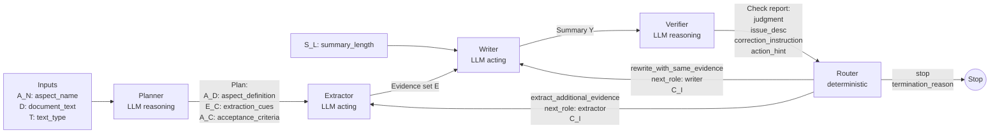
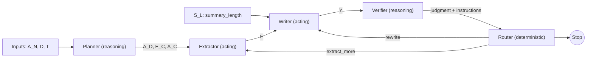

# Agentic Aspect-Based Scientific Summarization System

This system turns an **abstract aspect name** (e.g., *Background*, *Methods*, *Limitations*, *Contributions*) into a **faithful, aspect-focused summary** of a scientific document by decomposing the task into explicit roles. It operationalizes a “mental model” workflow (clarify → highlight evidence → write → review → decide next action) as an iterative, modular agent loop.

## Core Idea
Instead of asking one model to “summarize with respect to aspect A” end-to-end, the system:
1) **Plans** what the aspect means and how to recognize it in the paper,  
2) **Extracts** evidence spans that match the plan,  
3) **Writes** a summary strictly from those spans,  
4) **Verifies** aspect alignment + evidence faithfulness + completeness,  
5) **Routes** to the next step (rewrite vs. extract more) or stops.

---

## System Inputs

- `A_N`: aspect_name
- `D`: document_text
- `T`: text_type (e.g., full paper / section / structured abstract)
- `S_L`: summary_length (e.g. "200 words", "2 sentences")

## Modules

### 1) Planner (LLM, reasoning)
**Goal:** Translate an abstract aspect label into an actionable extraction plan.

**Inputs**
- `A_N`: aspect_name
- `D`: document_text
- `T`: text_type (e.g., full paper / section / structured abstract)

**Outputs (Plan)**
- `A_D`: aspect_definition *(string)*  
  What the aspect means in scientific summarization.
- `E_C`: extraction_cues *(list)*  
  Concrete criteria for selecting evidence (keywords, rhetorical moves, section hints, typical entities/relations).
- `A_C`: acceptance_criteria *(list)*  
  What a complete and acceptable aspect-summary must cover (minimum expected elements, exclusions, scope).

---

### 2) Extractor (LLM, acting)
**Goal:** Highlight multi-sentence, semantically coherent evidence spans relevant to the aspect.

**Inputs**
- `A_N`: aspect_name
- `D` : document_text
- `A_D`: aspect_definition *(optional, removed in Ablation)*
- `E_C`: extraction_cues *(optional, removed in Ablation)*
- `C_I`: correction_instruction *(optional, from Verifier/Router)*

**Output (Evidence Set `E`)**
A list of extracted spans (in document order). Each item contains:
- `span` *(string)*: the essential claim (one or more sentences).
- `section` *(string, optional)*: the document section this span came from (e.g., 'Methods', 'Results').

---

### 3) Writer (LLM, acting)
**Goal:** Produce an aspect-focused summary strictly grounded in the extracted evidence.

**Inputs**
- `A_N` : aspect_name
- `S_L`: summary_length (e.g. "200 words", "2 sentences")
- `A_D`: aspect_definition *(optional, removed in Ablation)*
- `E`: evidence_set
- `A_C`: acceptance_criteria *(optional, removed in Ablation)*
- `C_I`: correction_instruction *(optional, from Verifier/Router)*
- `P_S`: prior_summary *(optional, latest draft only; provided on revise_summary)*

**Output (Summary `Y`)**
- `summary_text` *(string)*: a single-paragraph, aspect-focused summary.

**Key constraint:** Every statement must be traceable to at least one evidence span; no new entities/claims/interpretations.

---

### 4) Verifier (LLM, reasoning)
**Goal:** Audit quality and decide whether the output is acceptable or needs revision.

**Inputs**
- `A_N` : aspect_name
- `Y`: summary_text
- `E`: evidence_set
- `A_D`: aspect_definition *(optional, removed in Ablation)*
- `A_C`: acceptance_criteria *(optional, removed in Ablation)*

**Checks**
1. **Aspect alignment:** Does `Y` match the intended aspect (`A_D`)?
2. **Faithfulness:** Is every claim in `Y` supported by `E`?
3. **Completeness:** Does `Y` satisfy `A_C`? Does `E` provide enough information for satisfying `A_C`?

**Output (Check Report)**
- `judgment`: `"accept" | "revise_summary" | "revise_evidence"`
- `issue_description`: brief description of the main problem
- `correction_instruction`: specific instructions for the next role
- `action_hint`: `"rewrite_with_same_evidence" | "extract_additional_evidence"`

---

### 5) Router (deterministic)
**Goal:** Enforce a single next step and iteration limits.

**Inputs**
- `judgment`, `issue_description`, `correction_instruction`, `action_hint`
- `iteration_count`, `max_iterations`

**Output (Routing Decision)**
- `next_role`: `"writer" | "extractor" | "stop"`
- `correction_instruction`: forwarded from the verifier
- `termination_reason`: `"success" | "max_retries_exceeded"` *(when stopping)*

**Note:** When routing to `writer` after `revise_summary`, the latest summary draft is provided as `prior_summary` to support revision.

---

## Dataflow (Mermaid, full)

## Dataflow (Mermaid, simple)

---

## Ablation Modes

The pipeline supports three modes controlled by `pipeline_mode`:

### 1) `full`
Runs the complete 5-role loop: Planner → Extractor → Writer → Verifier → Router.

### 2) `no_planner`
Skips the Planner and runs the remaining loop: Extractor → Writer → Verifier → Router. In this mode:
- `A_D`, `E_C`, and `A_C` are `None` and treated as optional inputs by downstream agents.
- Prompts must still function without plan fields.

### 3) `no_verifier`
Runs Planner → Extractor → Writer, then stops immediately (no Verifier or Router loop). In this mode:
- No judgments or routing decisions are produced.
- `termination_reason` is set to indicate the ablation stop.

---

## Batched Runner Notes

- The batched pipeline in src/2a2s/batch_2a2s.py preserves the same role order and per-sample state machine.
- Batched outputs carry a `unique_id` (from the dataset when available, otherwise a deterministic fallback) through trace steps and final results.
- HTML trace reports should surface `unique_id` in the header labeled “Record ID”.
- The batched runner supports optional state caching for resume, a separate planner cache, and can clear or reset cache via configuration.
- Parser errors are collected into a dedicated JSONL for targeted reprocessing.

---

## How this maps to the “mental model”

* **Clarify the aspect** → *Planner*
* **Highlight relevant evidence** → *Extractor*
* **Write from the highlights** → *Writer*
* **Review and diagnose** → *Verifier*
* **Decide the next action** → *Router* (stop / rewrite / extract more)
